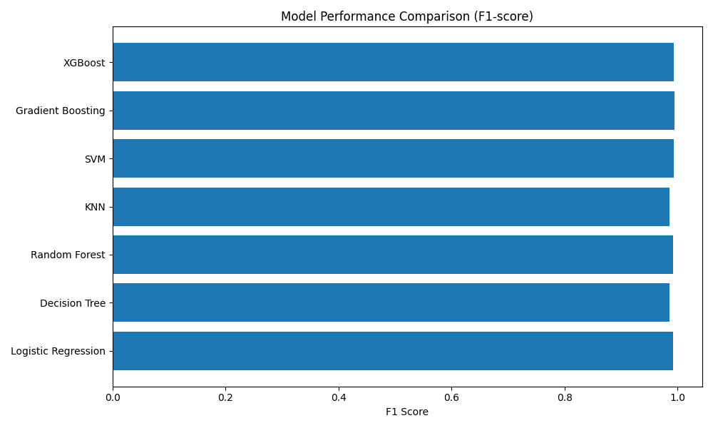
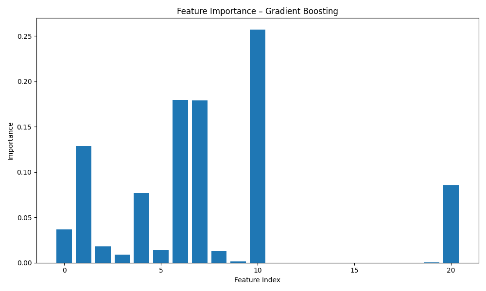

# NutriClass: Food Classification Using Nutritional Data

## Project Overview

NutriClass is a machine learning–based food classification system that predicts the exact food name using structured nutritional data such as calories, protein, fat, carbohydrates, sugar, fiber, and other related attributes.

The project is designed for strict diet planning scenarios, where users must consume only foods that precisely match predefined nutritional requirements.

---

## Problem Statement

Manual food classification based on nutritional values is time-consuming and prone to errors.  
This project aims to automate food classification using machine learning, enabling accurate, scalable, and consistent identification of food items based on nutritional metrics.

---

## Business Use Cases

### Smart Dietary Applications
Validate and classify foods that match user-defined nutritional goals.

### Health Monitoring Tools
Assist nutritionists in planning personalized diets.

### Food Logging Systems
Automatically classify food entries for tracking applications.

### Educational Platforms
Help learners understand nutrition-based food categorization through AI.

### Meal Planning & Grocery Apps
Ensure strict adherence to diet plans by classifying only approved food items.

---

## Dataset Description

- **Total Records:** ~31,700  
- **Missing Values:** ~375 missing values across numerical features  
- **Outliers:** Present in most numerical features  
- **Features:** 15 input features + 1 target  
- **Target Variable:** `Food_Name`

### Feature Types

- **Numerical:** Calories, Protein, Fat, Carbs, Sugar, Fiber, Sodium, Cholesterol, Glycemic Index, Water Content, Serving Size  
- **Categorical:** Meal Type, Preparation Method  
- **Boolean:** Is Vegan, Is Gluten Free  

The dataset exhibits right-skewed numerical distributions.

---

## Exploratory Data Analysis (EDA)

Key insights from EDA include:
- Presence of realistic outliers in nutritional features  
- Right-skewed distributions across most numerical columns  
- Moderate class imbalance among food categories  

These observations guided preprocessing and model selection decisions.

---

## Data Preprocessing

The following preprocessing steps were applied:

1. Removal of duplicate records  
2. Median imputation for missing numerical values  
3. IQR-based outlier capping  
4. RobustScaler for numerical feature scaling  
5. One-Hot Encoding for categorical features  
6. Label Encoding for the target variable  

Raw and processed datasets were stored separately to ensure reproducibility.

---

## Model Selection and Training

The following classifiers were trained and compared as per project requirements:

- Logistic Regression  
- Decision Tree  
- Random Forest  
- K-Nearest Neighbors (KNN)  
- Support Vector Machine (SVM)  
- Gradient Boosting Classifier  
- XGBoost  

---

## Evaluation Metrics

Each model was evaluated using:
- Accuracy  
- Precision  
- Recall  
- F1-score  
- Confusion Matrix  

Weighted metrics were used to handle class imbalance.

---

## Model Performance Comparison

| Model | F1-score |
|------|---------|
| KNN | 0.9853 |
| Decision Tree | 0.9860 |
| Logistic Regression | 0.9920 |
| Random Forest | 0.9927 |
| SVM | 0.9936 |
| **Gradient Boosting** | **0.9941** |
| XGBoost | 0.9935 |

**Gradient Boosting is the recommended model for this dataset, as it achieved the highest F1-score among all evaluated models.**

---

## Model Performance Visualization

---

## Confusion Matrix Analysis

Confusion matrices were generated for all trained models.  
Strong diagonal dominance indicates high classification accuracy
---

## Feature Importance

Feature importance analysis using the Gradient Boosting model highlights the most influential nutritional attributes contributing to food classification.

---

## Classification vs Recommendation

This project focuses on classification rather than recommendation.  
In strict diet planning scenarios, a single precise food choice is required to ensure nutritional compliance, making classification the appropriate approach.

---

## Project Structure

Nutriclass/
├── README.md
├── src/
├── data/
├── visuals/
└── reports/

---

## Conclusion

NutriClass demonstrates how machine learning can effectively classify food items using nutritional data. Through robust preprocessing, comprehensive model comparison, and detailed evaluation, the system achieves high accuracy and reliability, making it suitable for real-world dietary and nutrition-based applications.
